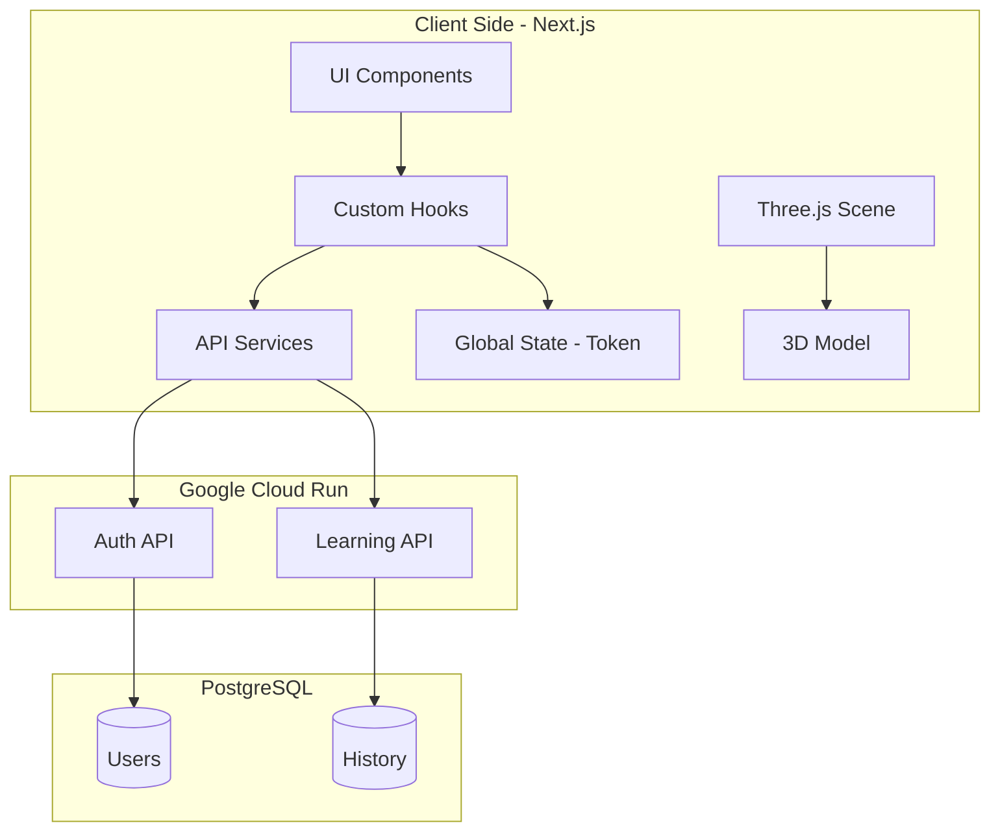

This is a [Next.js](https://nextjs.org/) project bootstrapped with [`create-next-app`](https://github.com/vercel/next.js/tree/canary/packages/create-next-app).

## Getting Started

First, run the development server:

```bash
npm run dev
# or
yarn dev
# or
pnpm dev
# or
bun dev
```

Open [http://localhost:3000](http://localhost:3000) with your browser to see the result.

You can start editing the page by modifying `app/page.tsx`. The page auto-updates as you edit the file.

This project uses [`next/font`](https://nextjs.org/docs/basic-features/font-optimization) to automatically optimize and load Inter, a custom Google Font.

## Learn More

To learn more about Next.js, take a look at the following resources:

- [Next.js Documentation](https://nextjs.org/docs) - learn about Next.js features and API.
- [Learn Next.js](https://nextjs.org/learn) - an interactive Next.js tutorial.

You can check out [the Next.js GitHub repository](https://github.com/vercel/next.js/) - your feedback and contributions are welcome!

## Deploy on Vercel

The easiest way to deploy your Next.js app is to use the [Vercel Platform](https://vercel.com/new?utm_medium=default-template&filter=next.js&utm_source=create-next-app&utm_campaign=create-next-app-readme) from the creators of Next.js.

Check out our [Next.js deployment documentation](https://nextjs.org/docs/deployment) for more details.


- **Diseño Responsivo**: Experiencia optimizada para escritorio y dispositivos móviles con estética pastel.

## 🛠️ Stack Tecnológico
- **Frontend**: Next.js 14 (App Router), React, Tailwind CSS.
- **3D Engine**: React Three Fiber / Drei (Three.js).
- **Backend**: Go (API REST desplegada en Google Cloud Run).
- **Autenticación**: JWT (Bearer Token).

## 🏗️ Arquitectura del Proyecto



### La estructura sigue los principios de **Clean Architecture**:
1. **Components**: UI reutilizable y desacoplada.
2. **Hooks**: Lógica de estado y efectos (Application Rules).
3. **Services**: Comunicación con agentes externos (API).
4. **App**: Enrutamiento y configuración de Next.js.

## 📄 Documentación de la API
La aplicación consume los siguientes servicios:

- POST /auth/login: Autenticación de usuario.

- POST /users: Registro de nuevos estudiantes.

- POST /learning/chat: Envío de prompts (Requiere Auth).

- GET /learning/history: Recuperación de respuestas procesadas.

